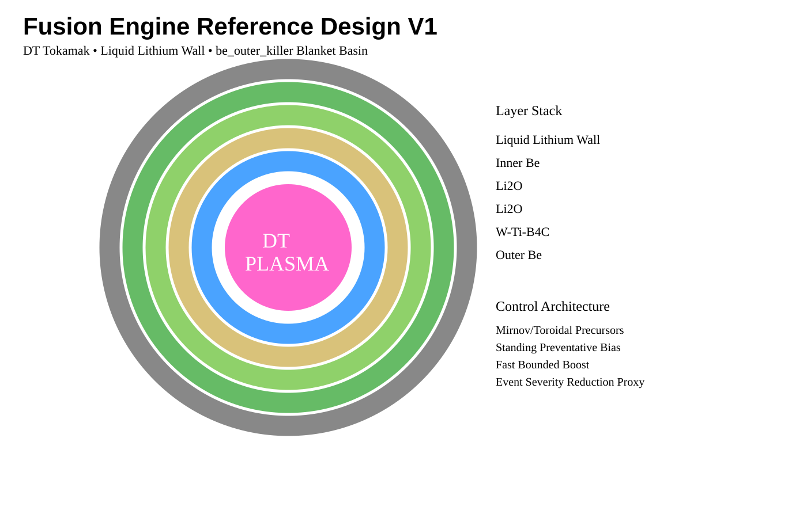

# Fusion Engine v5 / Fusion Blanket Design with TCT



This repository is Chase Lunsford's public research workspace for fusion blanket optimization and thickness-controlled tokamak (TCT) concept exploration.

The project combines a plasma/plant optimizer, blanket design search,
TCT/plasmoid-control proxies, wall-event modeling, lithium-wall thermal
handling, OpenMC-style finalist validation workflows, FAIR-MAST experimental
precursor screens, BOUT++ reduced-MHD actuator studies, Dedalus current-sheet
toy falsification studies, GEQDSK/EFIT anchoring, and M3D-C1-facing diagnostic
contracts.

## Audio overview

Start here for a narrative overview of the liquid-lithium actuator / TCT
hypothesis:

- [`Liquid_lithium_actuators_for_fusion_stability.m4a`](validation_runs/notebooklm_audio_review_default/Liquid_lithium_actuators_for_fusion_stability.m4a)
- [`NotebookLM audio review note`](validation_runs/notebooklm_audio_review_default/NOTEBOOKLM_AUDIO_REVIEW.md)
- [`Automatic transcript`](validation_runs/notebooklm_audio_review_default/liquid_lithium_actuators_transcript_tiny_en.txt)

Important boundary: the audio is a front-facing narrative and review aid, not
validation evidence. The current committed evidence supports reduced-model
toy/proxy studies and validation harnesses, not full tokamak-grade or
liquid-lithium actuator validation.

## Current best configuration

For the current mainline candidate and best-supported screening/validation basin, start here:

- [`WINNING_CONFIGURATION_SUMMARY.md`](WINNING_CONFIGURATION_SUMMARY.md)
- [`REFERENCE_DESIGN_V1.md`](REFERENCE_DESIGN_V1.md)
- [`M3DC1_BOUT_GEQDSK_VALIDATION_SUMMARY.md`](M3DC1_BOUT_GEQDSK_VALIDATION_SUMMARY.md)
- [`TCT_LANGUAGE_TRANSLATION.md`](TCT_LANGUAGE_TRANSLATION.md)
- [`docs/reference_design_v1_diagram.svg`](docs/reference_design_v1_diagram.svg)

Current short form:

> DT tokamak screening configuration with liquid-lithium-facing wall, lithium-current coupling retained as a hypothesis, `be_outer_kill` / `be_outer_killer` Be/Li2O/W-Ti-B4C/Be blanket basin, and Mirnov/toroidal-triggered standing-bias plus fast bounded-boost TCT proxy control.

This is not a demonstrated reactor design. It is the current best configuration for deeper validation and review.

## Repository-wide status snapshot

This repo is now best read as an open validation and falsification pipeline, not
as a single simulation result. The strongest committed evidence currently spans:

| Area | Current evidence | Claim boundary |
| --- | --- | --- |
| Blanket / neutronics screening | OpenMC-style and optimizer artifacts favor the `be_outer_kill` / `be_outer_killer` Be/Li2O/W-Ti-B4C/Be basin. | Screening basin only; final TBR and engineering constraints are not experimentally validated. |
| Experimental precursor timing | FAIR-MAST public diagnostics provide held-out timing support for Mirnov/toroidal precursor logic, including claim gates, nulls, fresh-trigger searches, and external-review packets. | Supports a timing prerequisite for preventative control; does not prove causal TCT suppression. |
| Forward control policy | FAIR-MAST reduced-order forward surrogate and sensitivity sweeps favor standing preventative bias plus fast bounded boost for the current trigger family. | Reduced-order policy evidence only; no measured TCT actuator transfer function. |
| BOUT++ reduced-MHD bridge | Resolved actuator robustness and closed-loop trigger studies pass with `PASS_WITH_REDUCED_MODEL_BOUNDARIES`; delayed triggers preserve the known timing falsification boundary. | Reduced-model current-sheet actuator evidence, not tokamak-grade validation. |
| Dedalus toy falsification | Biased current-sheet toy studies include matrix, parameter sweep, resolution check, and compact falsification study with an independent component proxy. | Numerical toy stress test with prescribed source terms; not liquid-lithium wall physics. |
| M3D-C1 / GEQDSK path | Candidate-0 handoff, public `C1.h5` integration checks, DIII-D GEQDSK/EFIT anchors, and M3D-C1-compatible contracts exist. | Harness/proxy/integration evidence only; not full M3D-C1 reactor validation. |
| Narrative / external review aids | NotebookLM audio overview, transcript, review note, and public positioning docs are committed. | Review/navigation aids only; not validation evidence. |

The conservative whole-repo claim is:

> This repository preserves a public, reproducible screening and falsification
> pipeline for a liquid-lithium-wall / TCT-coupled fusion concept. Current
> evidence is strongest for precursor timing, reduced-model current-sheet
> response, and reviewable validation scaffolding. It does not yet prove TCT,
> liquid-lithium actuation, final blanket TBR, sustained fusion, or reactor
> engineering viability.

## Citation / attribution

If this repository, its concepts, simulation structure, candidate geometries, validation workflow, or documentation influence downstream work, please cite or link back to this repository and credit:

> Chase Lunsford / `@chaseakat`  
> Fusion Blanket Design with TCT  
> https://github.com/CaMaLabs/Fusion_Blanket_Design_TCT

Citation metadata is provided in [`CITATION.cff`](CITATION.cff). Provenance details are provided in [`PROVENANCE.md`](PROVENANCE.md).

## Current status

This repository is a conceptual and computational design study, not a demonstrated reactor design.

Validated / implemented:

- Open repository structure for blanket / TCT design notes.
- Python-based optimizer and simulation workflows.
- Initial geometry and material-stack assumptions.
- Integrated design variables for blanket, wall, plasma, TCT, and plant-power proxies.
- Candidate scoring and filtering logic.
- Explicit-layer validation concepts for finalist blanket candidates.
- Reproducible scripts and committed outputs where available.
- FAIR-MAST experimental precursor/latency screens, fresh-trigger searches, null
  tests, and external-review packets.
- BOUT++ reduced-MHD actuator robustness and closed-loop trigger bridge with
  `PASS_WITH_REDUCED_MODEL_BOUNDARIES`.
- Dedalus reduced-MHD current-sheet toy matrix, parameter sweep, resolution
  check, and compact falsification study.
- GEQDSK/EFIT readiness artifacts and DIII-D anchoring/probe paths.
- M3D-C1-facing proxy/candidate artifacts and diagnostic/control contracts.
- NotebookLM audio overview, transcript, and claim-boundary review note.

Speculative / not yet validated:

- Net stabilization effect of the proposed TCT geometry.
- Practical alpha / electron channel separation.
- Full thermal survival of the proposed wall stack.
- Tritium breeding ratio under final geometry.
- Manufacturability of ribbed / channeled structures.
- Whether TCT-style current-sheet thickness control can be engineered into a practical tokamak control mechanism.
- Whether lithium-current coupling provides useful stabilizing leverage in the real plasma edge.
- Whether event-severity reductions translate into reactor-level reliability improvements.
- Whether Dedalus/BOUT++ source terms map to a physically realizable
  liquid-metal actuator.
- Whether M3D-C1/JOREK/NIMROD or experimental diagnostic data reproduce the
  reduced-model trigger and actuator effects.

## Project roadmap and funding alignment

- [`VALIDATION_STATUS.md`](VALIDATION_STATUS.md) gives the current validation-status matrix and claim boundaries.
- [`ROADMAP.md`](ROADMAP.md) frames the repository as a validation and reproducibility pipeline for fusion concept screening.
- [`FUNDING.md`](FUNDING.md) maps the pipeline to realistic SBIR/STTR, INFUSE-style partnership, AI-for-science, and later-stage funding paths.
- [`ARCHIVE_INDEX.md`](ARCHIVE_INDEX.md) explains how historical logs, backups, generated outputs, and validation-run folders should be interpreted without deleting provenance.
- [`docs/assumptions.md`](docs/assumptions.md) lists the assumptions that need review before any result is interpreted as evidence.
- [`docs/falsification_tests.md`](docs/falsification_tests.md) defines tests that could reject, redirect, or narrow the TCT framing.
- [`docs/external_review_references.md`](docs/external_review_references.md) lists external review/navigation links that are not themselves validation evidence.
- [`docs/benchmark_targets.md`](docs/benchmark_targets.md) lists candidate benchmark directions for MHD, blanket, and wall validation.

The recommended external framing is:

> Open-source validation and reproducibility pipeline for fusion concept screening and handoff to higher-fidelity neutronics and MHD workflows.

TCT is the first demonstration case. The pipeline should be evaluated independently of whether the specific TCT hypothesis survives later validation.

## What I am looking for

I am looking for technical critique on:

1. plasma stability assumptions,
2. blanket neutronics / TBR assumptions,
3. heat-flux handling,
4. material survivability,
5. validation strategy.

The most useful response would be to identify a wrong assumption, suggest a better simulation path, point to a benchmark case, or open an issue with a falsification test.

For a narrowly scoped DIII-D diagnostic collaboration request, review:

- [`validation_runs/diiid_diagnostic_reconstruction_default/DIIID_LIMITED_DATA_ACCESS_REQUEST.md`](validation_runs/diiid_diagnostic_reconstruction_default/DIIID_LIMITED_DATA_ACCESS_REQUEST.md)
- [`validation_runs/diiid_diagnostic_reconstruction_default/diiid_diagnostic_reconstruction_report.md`](validation_runs/diiid_diagnostic_reconstruction_default/diiid_diagnostic_reconstruction_report.md)
- [`validation_runs/diiid_diagnostic_reconstruction_default/diagnostic_replacement_contract.json`](validation_runs/diiid_diagnostic_reconstruction_default/diagnostic_replacement_contract.json)

For the current FAIR-MAST/TCT validation state, review:

- [`FAIR_MAST_TCT_VALIDATION_SUMMARY.md`](FAIR_MAST_TCT_VALIDATION_SUMMARY.md)
- [`fair_mast_claim_gate.py`](fair_mast_claim_gate.py)
- [`validation_runs/fair_mast_claim_gate_default/fair_mast_claim_gate_report.md`](validation_runs/fair_mast_claim_gate_default/fair_mast_claim_gate_report.md)
- [`validation_runs/fair_mast_external_review_packet_default/EXTERNAL_REVIEW_PACKET.md`](validation_runs/fair_mast_external_review_packet_default/EXTERNAL_REVIEW_PACKET.md)

For the first open experimental precursor / latency screen, review:

- [`fair_mast_elm_precursor_validation.py`](fair_mast_elm_precursor_validation.py)
- [`validation_runs/fair_mast_elm_precursor_default/fair_mast_elm_precursor_report.md`](validation_runs/fair_mast_elm_precursor_default/fair_mast_elm_precursor_report.md)
- [`validation_runs/fair_mast_elm_precursor_default/fair_mast_elm_precursor_summary.json`](validation_runs/fair_mast_elm_precursor_default/fair_mast_elm_precursor_summary.json)
- [`fair_mast_rmp_causal_analog.py`](fair_mast_rmp_causal_analog.py)
- [`validation_runs/fair_mast_rmp_causal_analog_default/fair_mast_rmp_causal_analog_report.md`](validation_runs/fair_mast_rmp_causal_analog_default/fair_mast_rmp_causal_analog_report.md)

## Fast technical review path

If you have 5 minutes:

1. Read this README.
2. Listen to or skim the [`Audio overview`](validation_runs/notebooklm_audio_review_default/Liquid_lithium_actuators_for_fusion_stability.m4a), then read the [`audio review note`](validation_runs/notebooklm_audio_review_default/NOTEBOOKLM_AUDIO_REVIEW.md) for claim boundaries.
3. Review the figure at [`docs/reference_design_v1_diagram.svg`](docs/reference_design_v1_diagram.svg).
4. Read [`WINNING_CONFIGURATION_SUMMARY.md`](WINNING_CONFIGURATION_SUMMARY.md).
5. Read [`FAIR_MAST_TCT_VALIDATION_SUMMARY.md`](FAIR_MAST_TCT_VALIDATION_SUMMARY.md).
6. Read [`M3DC1_BOUT_GEQDSK_VALIDATION_SUMMARY.md`](M3DC1_BOUT_GEQDSK_VALIDATION_SUMMARY.md).
7. Read [`VALIDATION_STATUS.md`](VALIDATION_STATUS.md).

If you have 30 minutes:

1. Review [`WINNING_CONFIGURATION_SUMMARY.md`](WINNING_CONFIGURATION_SUMMARY.md).
2. Review [`FAIR_MAST_TCT_VALIDATION_SUMMARY.md`](FAIR_MAST_TCT_VALIDATION_SUMMARY.md).
3. Review [`M3DC1_BOUT_GEQDSK_VALIDATION_SUMMARY.md`](M3DC1_BOUT_GEQDSK_VALIDATION_SUMMARY.md).
4. Review [`validation_runs/closed_loop_tct_trigger_default/closed_loop_trigger_report.md`](validation_runs/closed_loop_tct_trigger_default/closed_loop_trigger_report.md).
5. Review [`validation_runs/dedalus_current_sheet_biased_tct_falsification_study/ARTIFACT_NOTES.md`](validation_runs/dedalus_current_sheet_biased_tct_falsification_study/ARTIFACT_NOTES.md).
6. Review [`REFERENCE_DESIGN_V1.md`](REFERENCE_DESIGN_V1.md).
7. Review [`TCT_LANGUAGE_TRANSLATION.md`](TCT_LANGUAGE_TRANSLATION.md).
8. Review [`ROADMAP.md`](ROADMAP.md).
9. Review [`docs/assumptions.md`](docs/assumptions.md), [`docs/falsification_tests.md`](docs/falsification_tests.md), and [`docs/benchmark_targets.md`](docs/benchmark_targets.md).
10. Review [`ARCHIVE_INDEX.md`](ARCHIVE_INDEX.md) before interpreting historical logs or generated outputs.
11. Compare finalist assumptions against higher-fidelity OpenMC / M3D-C1 validation work.

## Research purpose

The central research question is whether a fusion reactor design can improve stability and survivability by combining:

- a liquid-lithium-facing wall or lithium-coupled first-wall layer,
- solid breeder / multiplier / armor blanket stacks,
- TCT-style current-sheet thickness control for plasmoid/reconnection suppression,
- event-severity reduction as a design objective,
- and neutronics / power-balance validation of promising blanket candidates.

This repo is intended to preserve the development path, code, assumptions, and candidate designs in a timestamped public form.

## Validation and public positioning

TCT is currently treated as an exploratory auxiliary-control hypothesis. Specific results should be interpreted according to the validation levels in [`docs/TCT_Validation_Matrix.md`](docs/TCT_Validation_Matrix.md).

Public wording and scope guidance are maintained in [`docs/TCT_Public_Positioning.md`](docs/TCT_Public_Positioning.md).

## Provenance

Author / researcher: Chase Lunsford (`@chaseakat`).

This repo was made public to establish visible provenance for the fusion blanket / TCT research path. The commit history, scripts, candidate files, and README notes should be treated as part of the public timestamped record of development.

See [`PROVENANCE.md`](PROVENANCE.md) for the full provenance note. See [`ARCHIVE_INDEX.md`](ARCHIVE_INDEX.md) before interpreting historical logs, backups, generated outputs, or preliminary validation-run folders.

## Settings

- Population size: 64
- Generations: 30
- Top 5 validated each generation
- OpenMC batches: 80
- OpenMC particles: 300000

## Run

```bash
pip install -r requirements.txt
python run_reactor_optimizer.py
```

## Notes

- Every design includes plasma + blanket + TCT + wall + plant variables.
- Top 5 each generation go through explicit-layer OpenMC validation.
- The rest use the fast surrogate to keep runtime manageable.
- Results should be interpreted as screening outputs until independently validated.

## Suggested reading order

1. Start with this README.
2. Review [`docs/reference_design_v1_diagram.svg`](docs/reference_design_v1_diagram.svg).
3. Read [`WINNING_CONFIGURATION_SUMMARY.md`](WINNING_CONFIGURATION_SUMMARY.md).
4. Read [`FAIR_MAST_TCT_VALIDATION_SUMMARY.md`](FAIR_MAST_TCT_VALIDATION_SUMMARY.md).
5. Read [`M3DC1_BOUT_GEQDSK_VALIDATION_SUMMARY.md`](M3DC1_BOUT_GEQDSK_VALIDATION_SUMMARY.md).
6. Read [`validation_runs/closed_loop_tct_trigger_default/closed_loop_trigger_report.md`](validation_runs/closed_loop_tct_trigger_default/closed_loop_trigger_report.md).
7. Read [`validation_runs/dedalus_current_sheet_biased_tct_falsification_study/ARTIFACT_NOTES.md`](validation_runs/dedalus_current_sheet_biased_tct_falsification_study/ARTIFACT_NOTES.md).
8. Read [`REFERENCE_DESIGN_V1.md`](REFERENCE_DESIGN_V1.md).
9. Read [`TCT_LANGUAGE_TRANSLATION.md`](TCT_LANGUAGE_TRANSLATION.md).
10. Read [`VALIDATION_STATUS.md`](VALIDATION_STATUS.md).
11. Read [`docs/assumptions.md`](docs/assumptions.md), [`docs/falsification_tests.md`](docs/falsification_tests.md), and [`docs/benchmark_targets.md`](docs/benchmark_targets.md).
12. Review [`ROADMAP.md`](ROADMAP.md) and [`FUNDING.md`](FUNDING.md).
13. Review [`PROVENANCE.md`](PROVENANCE.md), [`ARCHIVE_INDEX.md`](ARCHIVE_INDEX.md), and [`CITATION.cff`](CITATION.cff).
14. Read [`docs/TCT_Public_Positioning.md`](docs/TCT_Public_Positioning.md) and [`docs/TCT_Validation_Matrix.md`](docs/TCT_Validation_Matrix.md).
15. Inspect optimizer and candidate-generation scripts, committed result files, and finalist candidates.
