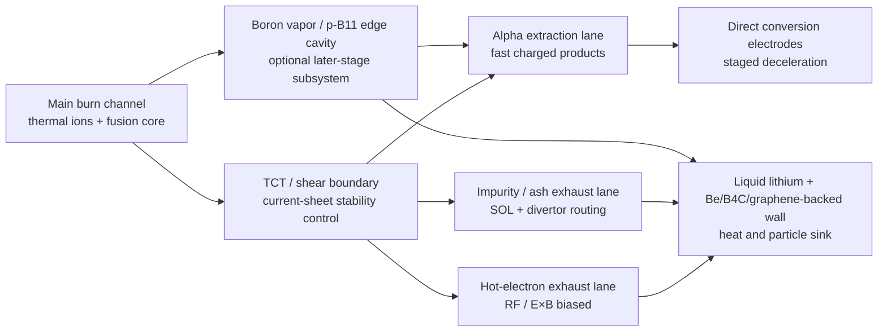
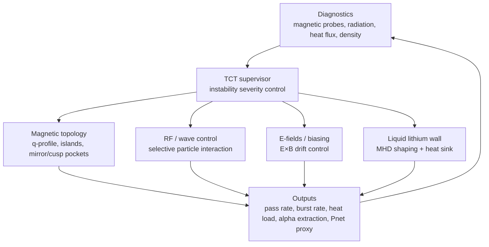
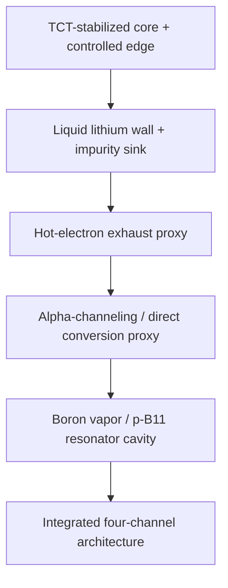

# Plasma Channel Architecture Diagrams

These diagrams are conceptual only. They are intended to communicate architecture and control logic, not final engineering geometry.

## Functional channel map



## Control stack



## Development sequence



## Conceptual radial layering

```text
                 Plasma / reactor cross-section concept

       -----------------------------------------------------
       | Outer structure / neutron + heat management        |
       |   Be / B4C / SiC-compatible support layer          |
       |   graphene-channel thermal spreader layer          |
       |   flowing liquid lithium wall / breeder / getter   |
       |---------------------------------------------------|
       | scrape-off / impurity / ash exhaust lane           |
       |---------------------------------------------------|
       | hot-electron biased exhaust / radiative edge       |
       |---------------------------------------------------|
       | alpha extraction / direct conversion access lane   |
       |---------------------------------------------------|
       | main burn channel + TCT-stabilized shear boundary  |
       -----------------------------------------------------
```

## Important interpretation

The word “channel” means a preferred transport route in phase space and magnetic topology. It does **not** mean a rigid physical pipe inside the plasma.
