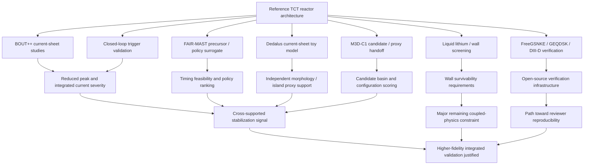

# Integrated Evidence Report: TCT Reduced-Model Stabilization Stack

Author / project context: Chase Lunsford / CaMaLabs

Status: evidence synthesis from public repository artifacts plus project-level reduced-model context.

## Executive summary

This repository is not just a concept repository. It now contains a reduced-model validation stack for a TCT-centered fusion architecture. The strongest defensible finding is:

> Across multiple reduced-order subsystem studies, preemptive localized TCT-style control repeatedly improves stability-related proxy metrics, especially current-sheet severity, event-loss proxy, timing feasibility, and configuration scoring. The evidence does not yet constitute whole-reactor validation, but it is strong enough to justify higher-fidelity integrated validation.

The important distinction is not whether any measurable effect exists. The measurable effects are present in the reduced models. The remaining question is whether those effects survive higher-fidelity coupling among plasma dynamics, wall loading, liquid lithium behavior, blanket response, diagnostics, and actuator physics.

## Claim levels used in this report

| Level | Meaning |
|---|---|
| Demonstrated reduced-model effect | A deterministic repo artifact reports a quantitative improvement in its defined metric. |
| Cross-supported reduced-model effect | Multiple independent reduced subsystems point in the same direction. |
| Plausible architecture-level implication | The subsystem results are mutually consistent with a larger TCT reactor hypothesis. |
| Not yet demonstrated | Requires higher-fidelity solver output, experiment, or integrated multi-physics validation. |

## Architecture being evaluated

The working architecture is a DT tokamak-oriented system using:

- TCT-style preemptive localized stabilization.
- Mirnov / toroidal precursor logic where available.
- Standing bias plus bounded fast boost as the preferred control posture.
- Liquid-lithium wall or lithium-facing plasma-facing component concepts.
- Be outer / blanket configuration screening.
- M3D-C1-facing candidate handoff and proxy backend extraction.
- BOUT++ and Dedalus reduced-MHD current-sheet validation paths.
- FreeGSNKE / GEQDSK / DIII-D-facing open-source verification paths.

The architecture-level hypothesis is:

> If edge/current-sheet severity can be reduced early enough, and if the wall/blanket/liquid-lithium modules remain inside their stability and survivability envelopes, then the combined module stack should improve reactor stability margins relative to the uncontrolled reference configuration.

That is stronger than a loose idea, but it is still short of full reactor proof.

## Evidence matrix

### 1. BOUT++ current-sheet and actuator robustness

Purpose: test whether localized actuator-like damping can reduce current-sheet severity metrics in a reduced-MHD current-sheet model.

Public artifacts include:

- `bout_tct_current_sheet_sweep.py`
- `bout_tct_actuator_robustness_sweep.py`
- `validation_runs/m3dc1_bout_cross_validation_default/cross_validation_summary.json`
- `M3DC1_BOUT_GEQDSK_VALIDATION_SUMMARY.md`

Representative reported effects:

| Case | Metric | Result |
|---|---|---|
| Nominal actuator | post-initial peak current | ~14.16% reduction |
| Nominal actuator | integrated max current | ~65.33% reduction |
| Strong robustness case | post-initial peak current | ~20.41% reduction |
| Strong robustness case | integrated current | ~74.89% reduction |
| Delayed timing case | peak current | 0% reduction |
| Delayed timing case | integrated current | still reduced |

Interpretation:

The key result is not simply that control improves a number. The key result is that the model preserves a timing boundary. Early control reduces peak and integrated severity. Late control can reduce integrated exposure while failing to reduce the peak. That is exactly the kind of falsification boundary a serious stabilization claim needs.

Claim level: demonstrated reduced-model effect; cross-supported timing implication.

Remaining limitations:

- The actuator is not yet a fully physical hardware model.
- The control term is a reduced representation.
- The model does not by itself prove whole-reactor stabilization.
- Higher-fidelity M3D-C1 or experimental diagnostic replacement is still needed.

### 2. Closed-loop TCT trigger validation

Purpose: move from open-loop control to trigger-aware timing tests.

Public artifacts include:

- `closed_loop_tct_trigger_validation.py`
- `validation_runs/closed_loop_tct_trigger_default/closed_loop_trigger_report.md`

Representative reported effects:

| Case | Metric | Result |
|---|---|---|
| Nominal closed-loop | post-initial peak current | ~14.16% reduction |
| Nominal closed-loop | integrated current | ~65.33% reduction |
| Best listed closed-loop case | integrated current | ~69.98% reduction |
| Latency / late case | peak current | 0% reduction |
| Latency / late case | integrated current | still reduced, but weaker |

Interpretation:

This is one of the strongest artifacts in the repo because it connects measurable stabilization to trigger timing. The model says the TCT concept is not magic. It has a timing window. Hit the window and peak severity falls. Miss the window and peak control can fail.

Claim level: demonstrated reduced-model effect.

Remaining limitations:

- Trigger diagnostics still need replacement with real M3D-C1 fields or experimental magnetic diagnostics.
- Latency assumptions need hardware-grounded values.
- The result is a reduced closed-loop contract, not reactor validation.

### 3. FAIR-MAST precursor and forward-control surrogate

Purpose: test whether precursor timing and bounded boost logic are plausible in a machine-data-inspired reduced control setting.

Public artifacts include:

- `validation_runs/fair_mast_elm_precursor_default/fair_mast_elm_precursor_summary.json`
- `validation_runs/fair_mast_tct_forward_surrogate_default/fair_mast_tct_forward_surrogate_report.md`
- `validation_runs/fair_mast_tct_forward_sensitivity_default/fair_mast_tct_forward_sensitivity_report.md`
- `validation_runs/fair_mast_claim_gate_default/fair_mast_claim_gate_report.md`

Representative reported effects:

| Study | Result |
|---|---|
| Precursor detection | 24 detections out of 28 events |
| Recall | ~0.857 |
| Precision | ~0.545 |
| Median lead time | ~4.979 ms |
| Mirnov/toroidal fast boost | ~51.5% mean proxy-loss reduction |
| Preventative bias only | ~24.8% mean proxy-loss reduction |
| Sensitivity sweep | Mirnov/toroidal fast-boost family remained tied for best realizable policy in 320/320 scenarios |

Interpretation:

This supports the same control architecture seen in BOUT++: standing bias helps, but the best behavior comes from standing bias plus fast bounded boost when the trigger arrives early enough. It also preserves real constraints: false triggers, finite lead time, and latency feasibility.

Claim level: supported proxy-only; cross-supported timing/control effect.

Remaining limitations:

- This is not a real actuator experiment.
- False-trigger burden matters.
- Expert-labeled events and hardware-response measurements are still needed.

### 4. Dedalus current-sheet toy model

Purpose: provide an independent reduced-MHD toy check on current-sheet morphology, island proxies, and localized control structure.

Public artifacts include:

- `validation_models/dedalus_current_sheet/`
- `validation_runs/dedalus_current_sheet_biased_tct_falsification_study/ARTIFACT_NOTES.md`

Representative reported effects:

| Case family | Metric | Result |
|---|---|---|
| Combined smoothing + bias | island-proxy reduction | positive retained reductions |
| Weakest positive combined case | island proxy | ~33.3% reduction |
| Strongest listed row | island proxy | ~89.3% reduction |
| Strongest listed row | component proxy | ~66.7% reduction |
| Smoothing-only | falsification screen | did not pass compact screen |

Interpretation:

The important result is that the toy model does not endorse every control variant. Combined smoothing plus bias survives better than smoothing-only. That matches the broader architecture preference for standing bias plus bounded boost.

Claim level: lower-confidence reduced-model support; useful falsification signal.

Remaining limitations:

- Toy reduced-MHD model.
- No liquid lithium free surface.
- No electrode/sheath/contact-resistance physics.
- Source terms still need stronger physical mapping.
- Island counting needs more topology-rigorous diagnostics.

### 5. M3D-C1-facing candidate and proxy validation

Purpose: create a reviewer-facing handoff path from the reference configuration into a deterministic candidate matrix and backend/proxy evaluation contract.

Public artifacts include related material in this repo and in `CaMaLabs/M3DC1`, including:

- `M3DC1_BOUT_GEQDSK_VALIDATION_SUMMARY.md`
- `CaMaLabs/M3DC1/validation/candidate0_be_outer_killer.json`
- `CaMaLabs/M3DC1/validation/generate_case_matrix.py`
- `CaMaLabs/M3DC1/validation/physics_engine.py`
- `CaMaLabs/M3DC1/validation/generated/candidate0_physics_results.csv`

Representative reported effects from the public candidate matrix:

| Case | Metric | Direction |
|---|---|---|
| `aggressive_tct` vs baseline | proxy score | ~26.6% gain |
| `aggressive_tct` vs baseline | TBR proxy | increased from ~1.1008 to ~1.1408 |
| `aggressive_tct` vs baseline | blanket heat proxy | increased from ~62.28 MW to ~67.65 MW |
| lithium-current variant | independent separation | retained as hypothesis, not separately proven in public proxy output |

Interpretation:

The M3D-C1-facing pathway is valuable because it freezes a candidate basin and makes the assumptions inspectable. It supports the TCT-strength ranking in the proxy model. It does not yet prove lithium-current coupling as an independent physical effect.

Claim level: demonstrated deterministic proxy effect; not yet high-fidelity M3D-C1 validation.

Remaining limitations:

- Much of the public M3D-C1 path is still proxy/staging logic.
- Real backend outputs must replace proxy quantities for stronger claims.
- Candidate pass/fail gates are useful but not equivalent to reactor proof.

### 6. FreeGSNKE, GEQDSK, and DIII-D-facing verification

Purpose: avoid purely custom validation by incorporating recognized open-source or machine-data-adjacent tooling paths.

Public artifacts include:

- `scripts/run_freegsnke_verifier.py` in `CaMaLabs/M3DC1`
- `validation/results/freegsnke_verifier_summary.json` in `CaMaLabs/M3DC1`
- `diiid_jpar0_reconstruction.py`
- `diiid_bout_operator_validation.py`
- `diiid_jpar0_elm_response.py`

Representative reported effects:

| Path | Result |
|---|---|
| FreeGSNKE verifier | 3 pytest targets passed in the public summary |
| GEQDSK Jpar0 reconstruction | finite provisional current reconstruction path |
| DIII-D operator checks | manufactured-operator validation path |
| Jpar0 response | finite distinguishable short response when including provisional current |

Interpretation:

These artifacts are not stabilization proofs. They are verification infrastructure. Their importance is that they make the repo less isolated: equilibrium, geometry, and machine-input handling are being connected to open-source or public-data-facing tools.

Claim level: software verification / validation infrastructure.

Remaining limitations:

- These paths do not by themselves validate TCT physics.
- The next step is to feed validated diagnostics into the closed-loop trigger contract.

### 7. Liquid lithium / first-wall subsystem

Purpose: support the wall-facing side of the architecture: liquid lithium retention, heat handling, MHD drag, CPS/wick-like stabilization, and plasma-facing survivability.

Public artifacts currently include:

- `fusion_engine_v5/engine/lithium_wall.py`
- lithium-wall / first-wall entries in `VALIDATION_STATUS.md`
- lithium-current references in candidate and configuration documents

Project-level context also includes newer lithium stabilization direction based on surface stabilization, capillary confinement, microtexture/wetting, Leidenfrost/vapor-film risk, inert gas or plasma boundary damping, and bubble/coalescence suppression. That newer direction should become a dedicated public module rather than remaining only as design rationale.

Current public status:

| Subsystem | Public evidence status |
|---|---|
| lithium wall heat / MHD screening | present as reduced screening logic |
| retained lithium-current hypothesis | present but not independently proven |
| CPS / porous confinement | design direction, not yet full public validation module |
| lithium free-surface stability | should be promoted to explicit deterministic module |
| vapor blanketing / Leidenfrost risk | should be included as falsification mode |
| plasma/gas boundary damping | should be included as reduced stabilizing term |

Interpretation:

The liquid-lithium branch is architecturally important because wall stability determines whether plasma-control gains survive contact with real heat and material constraints. Public artifacts currently support screening-level wall reasoning and retained hypotheses. They should be extended into a dedicated validation path with the same rigor as the BOUT++ trigger work.

Claim level: partial reduced screening plus architecture-level support; dedicated public free-surface validation still needed.

Recommended next module:

- `liquid_lithium_stability/`
- `scripts/run_liquid_lithium_stability.py`
- deterministic scenario matrix for free pool, ribbed substrate, porous/wick substrate, microtexture, vapor-film-prone surface, argon cover, weak plasma boundary, and combined stabilization
- metrics for perturbation growth, final surface amplitude, bubble/coalescence risk, vapor-film risk, lithium retention, and stability regime
- explicit failure cases: dryout, vapor blanketing, poor wetting, excessive perturbation, weak plasma shear, absent magnetic damping

## Cross-subsystem convergence

The strongest part of the evidence stack is convergence. The independent subsystems do not prove the same thing in the same way, but they repeatedly select the same engineering posture:

1. Stabilization needs to be early.
2. A standing bias alone helps but is not the strongest policy.
3. Fast bounded boost improves proxy outcomes when timing is feasible.
4. Late actuation can miss peak suppression.
5. Localized current-sheet conditioning is more plausible than global slow correction.
6. Wall/liquid-metal stability must be validated as a coupled boundary, not assumed.

That convergence makes the architecture more credible than a single isolated simulation would.

## Integrated evidence graph

## Claim audit

| Claim | Status | Reason |
|---|---|---|
| TCT-style preemptive control reduces current-sheet severity in reduced BOUT++ models | Demonstrated reduced-model effect | Public BOUT++ summaries report positive peak and integrated-current reductions. |
| Timing matters | Demonstrated reduced-model effect | Delayed cases preserve failure boundary for peak reduction. |
| Standing bias plus fast bounded boost is preferred over bias alone | Cross-supported reduced-model effect | FAIR-MAST surrogate and Dedalus/BOUT patterns align. |
| The reference candidate basin improves proxy score under stronger TCT settings | Demonstrated deterministic proxy effect | M3D-C1-facing candidate matrix reports score improvement. |
| Lithium-current coupling is independently proven | Not yet demonstrated | Public artifacts retain it as hypothesis. |
| Liquid lithium free-surface stability is validated at the same level as BOUT++ current-sheet work | Not yet demonstrated publicly | Needs dedicated lithium stability module. |
| TCT plus specified modules strongly motivates integrated reactor validation | Plausible architecture-level implication | Multiple subsystem models point in the same direction. |
| TCT is proven to stabilize a complete reactor | Not yet demonstrated | Requires coupled high-fidelity validation and/or experiment. |

## Comparison with current fusion research direction

The current fusion field is rewarding five things that overlap with this project:

1. Validation-first reactor design.
2. Quantified uncertainty and explicit pass/fail gates.
3. Plasma control and disruption/ELM mitigation.
4. First-wall and plasma-facing component survival.
5. Liquid-metal / liquid-lithium PFC exploration.

This project aligns best with the validation-first and edge/PFC-control portions of that landscape. It does not compete directly with SPARC/ARC core confinement, NIF ignition physics, or W7-X stellarator optimization. Its most credible contribution is an open reduced-model evidence chain for a combined control-and-wall architecture.

## What should be done next

Highest-value next steps:

1. Promote the liquid-lithium stability concept into a public deterministic validation module.
2. Replace reduced trigger diagnostics with authorized M3D-C1 or experimental magnetic diagnostics where possible.
3. Keep the delayed/late actuation case as a permanent falsification gate.
4. Add topology-rigorous island diagnostics to the Dedalus path.
5. Add a single manifest listing commit hashes, seeds, run commands, generated artifacts, and claim level for every result.
6. Create a `VALIDATION_TRACEABILITY.md` table mapping each claim to exact files and outputs.

## Recommended repository additions

Suggested follow-up files:

- `docs/VALIDATION_TRACEABILITY.md`
- `docs/EVIDENCE_MATRIX.md`
- `liquid_lithium_stability/README.md`
- `scripts/run_liquid_lithium_stability.py`
- `validation_runs/liquid_lithium_stability_default/summary.json`
- `validation_runs/liquid_lithium_stability_default/scenario_matrix.csv`

## Bottom line

The public and project-level reduced-model evidence stack supports a stronger statement than "interesting concept." It supports:

> Multiple independently constructed reduced-order subsystem models show measurable stabilization-related improvements under the TCT architecture, especially when control is early, localized, and implemented as standing bias plus bounded fast boost. The integrated pattern strongly motivates higher-fidelity validation of the complete specified module stack.

It does not yet support:

> The complete reactor is proven stable.

That distinction is the best way to defend the work without weakening it. The reduced models have already shown measurable effects. The next task is to make the wall/liquid-lithium branch as explicit, deterministic, and falsifiable as the BOUT++ closed-loop current-sheet branch.
